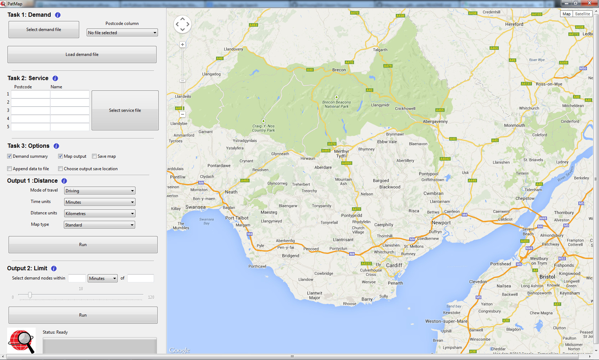

# PatMap Ver. 1.0

Mapping software allows the user to calculate the distance between demand and service locations. Also shows all locations
that are within a certain parameter.

Patmap is software built in Python 2.7.
The following open source modules are used :

- wxPython (Dev. build 2.9.1)
- xlrd
- xlwt (for reading and writing excel 2003 files)
- openpyxl (For reading and writing excel 2010 files)
- A modified version of pygmaps (For writing html files to display within the tool)

The GIS part of the tool makes use of the following APIs:

- [Google Maps Javascript API v3](https://developers.google.com/maps/documentation/javascript/usage#usage_limits)
- [Distance Matrix](https://developers.google.com/maps/documentation/distancematrix/#RequestParameters)
- [Static Maps](https://developers.google.com/maps/documentation/staticmaps/#Limits)
- [Geocoding Service](https://developers.google.com/maps/documentation/geocoding/#Limits)

and these APIs are subject to the the usage limits given by Google in the relevant API documentation.

Here is a screenshot of the tool:

The Repo also contains an exe built using py2exe. This exe is for 64 bit windows systems. Although not fully tested,
the exe does not appear to work on a 32 bit system.

The tool has been used to process several data sets, but still requires testing.

# To do

There are various aspects that will hopefully be improved in the near future:

- Packaging for MacOS
- Packaging for Linux
- Cli app
- Better handling of GUI on variable screen resolutions

---

# License Information
This work is licensed under a [Creative Commons Attribution-ShareAlike 3.0](http://creativecommons.org/licenses/by-sa/3.0/us/) license.  You are free to:

- Share: copy, distribute, and transmit the work,
- Remix: adapt the work

Under the following conditions:

- Attribution: You must attribute the work in the manner specified by the author or licensor (but not in any way that suggests that they endorse you or your use of the work).
- Share Alike: If you alter, transform, or build upon this work, you may distribute the resulting work only under the same or similar license to this one.

When attributing this work, please include me.
